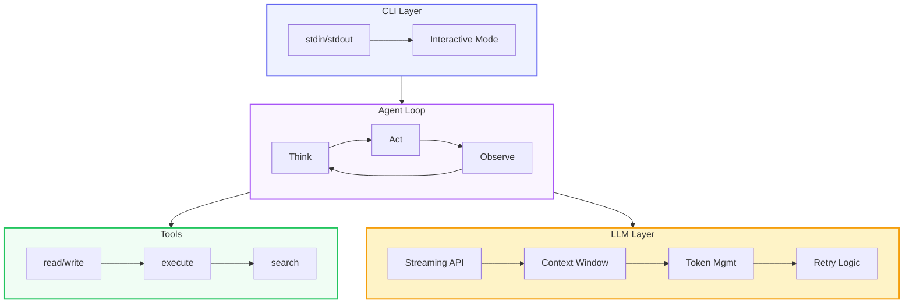

# Introduction & Project Setup

Welcome to building **Claude Code** — an AI-powered coding agent that operates directly in your terminal. By the end of this system, you'll have built a fully functional agent loop, tool execution system, and streaming LLM integration.

## What We're Building

An AI coding agent has three core layers, visualized below:



## Project Structure

Create the following project structure:

```
claude-code-agent/
├── package.json
├── tsconfig.json
├── src/
│   ├── index.ts          # Entry point
│   ├── cli.ts            # CLI interface
│   ├── agent/
│   │   ├── loop.ts       # Agent loop (think → act → observe)
│   │   ├── context.ts    # Context window management
│   │   └── types.ts      # Agent types
│   ├── tools/
│   │   ├── registry.ts   # Tool registry
│   │   ├── filesystem.ts # File read/write tools
│   │   ├── execute.ts    # Command execution tool
│   │   └── search.ts     # Search tool
│   ├── llm/
│   │   ├── client.ts     # LLM API client
│   │   ├── streaming.ts  # Streaming response handler
│   │   └── prompts.ts    # System prompts and templates
│   └── utils/
│       ├── logger.ts     # Logging utility
│       └── config.ts     # Configuration
├── design/
│   ├── decisions.md      # Engineering Decision Log
│   └── architecture.md   # Architecture documentation
└── .100x.json
```

## Step 1: Initialize the Project

```bash
mkdir claude-code-agent && cd claude-code-agent
npm init -y
```

Set `"type": "module"` in `package.json` so we can use ES modules.

## Step 2: Install Dependencies

```bash
npm install commander@latest  # CLI framework
npm install @anthropic-ai/sdk  # Anthropic API client (or similar)
npm install zod@latest         # Schema validation

npm install -D typescript@latest
npm install -D @types/node
npm install -D tsx@latest       # TypeScript execution
```

## Step 3: Configure TypeScript

Create `tsconfig.json`:

```json
{
  "compilerOptions": {
    "target": "ES2022",
    "module": "ESNext",
    "moduleResolution": "bundler",
    "outDir": "./dist",
    "rootDir": "./src",
    "strict": true,
    "esModuleInterop": true,
    "declaration": true,
    "resolveJsonModule": true
  },
  "include": ["src/**/*"]
}
```

## Step 4: Create Entry Point

Create `src/index.ts`:

```typescript
#!/usr/bin/env node

import { createCLI } from './cli.js';

async function main() {
  const cli = createCLI();
  await cli.run();
}

main().catch(console.error);
```

## Step 5: Create the CLI Interface

Create `src/cli.ts`:

```typescript
import { Command } from 'commander';
import { Agent } from './agent/loop.js';

export function createCLI() {
  const program = new Command();

  program
    .name('claude-code')
    .description('AI-powered coding agent')
    .version('0.1.0');

  program
    .command('chat')
    .description('Start an interactive chat session')
    .argument('[message]', 'Initial message')
    .action(async (message?: string) => {
      const agent = new Agent();
      await agent.start({ initialMessage: message });
    });

  program
    .command('execute')
    .description('Execute a single instruction')
    .argument('<task>', 'Task description')
    .action(async (task: string) => {
      const agent = new Agent();
      const result = await agent.executeTask(task);
      console.log(result);
    });

  return program;
}
```

## Step 6: Verify Everything Works

```bash
npx tsc --noEmit    # TypeScript type checking
node dist/index.js --help  # Should show available commands
```

## Key Design Decision

We chose **Commander** as our CLI framework because:

- It's battle-tested with millions of daily users
- Supports subcommands, options, and help generation automatically
- Lightweight — no unnecessary dependencies
- Excellent TypeScript support

## Validation Checklist

Before moving to the next lesson, ensure:

- [ ] `package.json` exists with all dependencies
- [ ] `tsconfig.json` exists with proper configuration
- [ ] `src/index.ts` has the entry point
- [ ] `src/cli.ts` has the CLI definition
- [ ] `src/agent/` directory exists
- [ ] `src/tools/` directory exists
- [ ] `src/llm/` directory exists
- [ ] `npx tsc --noEmit` passes without errors
- [ ] `npm run build` completes successfully
